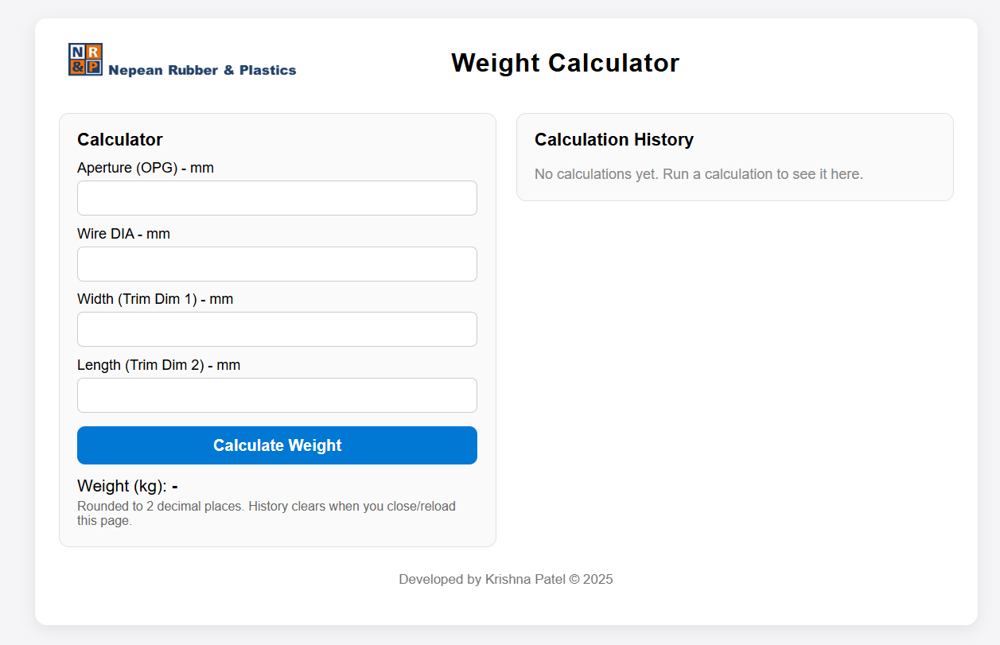
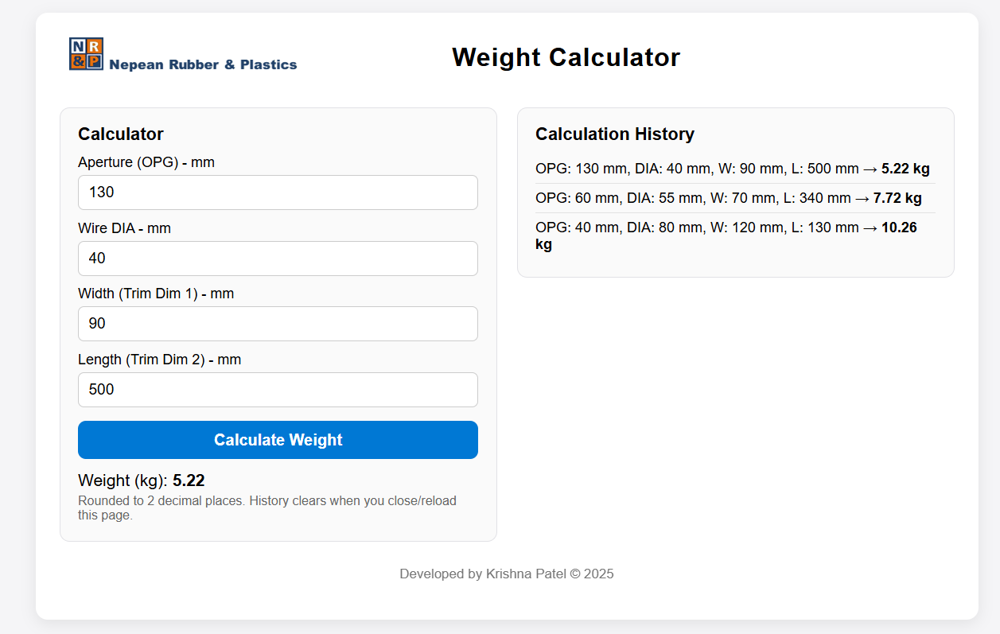

# Woven Screen Weight Calculator

A browser-based web application that calculates the weight of woven wire screens for manufacturing and freight estimation.

---

## 🌐 Live Demo
🔗 https://patelkrishna02.github.io/woven-weight-calculator/

---

## 💡 Problem Solved
Manual weight calculations for woven wire screens are repetitive and time-consuming, especially during quoting and estimation.

This tool simplifies the process by allowing users to input key parameters and instantly generate accurate weight calculations.

---

## 📌 Features
- Real-time weight calculation based on:
  - Aperture (OPG)
  - Wire Diameter (DIA)
  - Screen Width (Trim Dim 1)
  - Screen Length (Trim Dim 2)
- Instant output for quick estimation workflows  
- Clean and responsive user interface  
- Session-based calculation history  
- Fully client-side (no backend required)  
- Works offline after load
- Session-based calculation history (resets on page reload)

---

## 🛠 Tech Stack
- HTML5  
- CSS3  
- JavaScript 

---

## 🖼️ Screenshots

---

## 🚀 How to Run Locally
1. Clone the repository  
2. Open **index.html** in your browser  

---

## 📁 Project Structure
index.html  
css/  
└── style.css  
js/  
└── main.js  

---

## 🔗 Related Project
- PU Screen Generator: https://github.com/PatelKrishna02/pu-screen-generator  

---

## 👤 Author
**Krishna Patel**  
Developed during internship at Nepean Rubber & Plastics  

---

## 📝 License
MIT License
